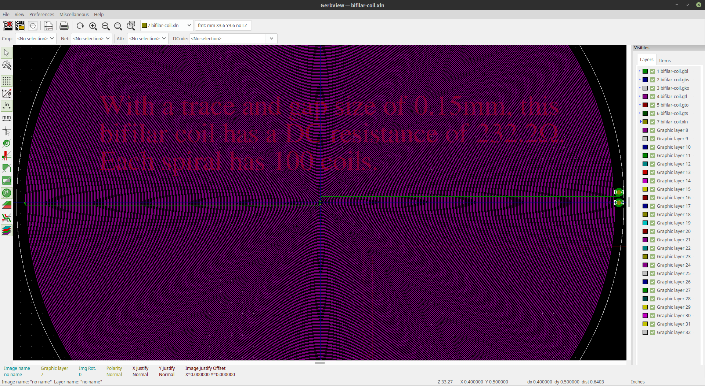
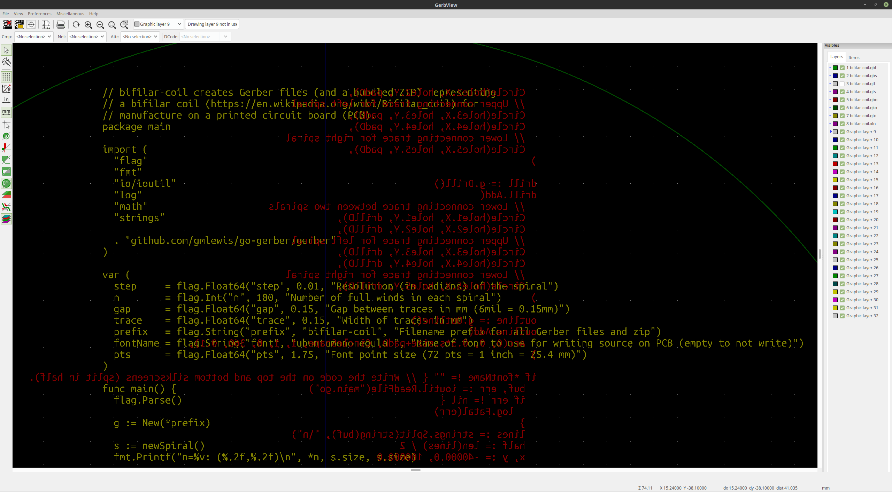

# Write Gerber RS274X files (for PCBs) in Go

This is an experimental package used to write Gerber (RS274X) files
and bundle them into a ZIP file to send to printed circuit board (PCB)
manufacturers, all from Go code.

## Example

```bash
pushd examples/bifilar-coil
go run main.go
gerbview bifilar-coil.g* bifilar-coil.xln
```

generates:



and this shows the font and top/bottom silkscreen support:



## Status
[](https://godoc.org/github.com/gmlewis/go-gerber/gerber)
[](https://travis-ci.org/gmlewis/go-gerber)

----------------------------------------------------------------------

## Webfonts using `go-fonts`

Webfont support has been switched to using
[github.com/gmlewis/go-fonts](https://github.com/gmlewis/go-fonts).

Below are some example fonts but there are many more in the `go-fonts` repo
to choose from.

### AaarghNormal


### Fascinate_InlineRegular


### GoodDogRegular


### HelsinkiRegular


### LatoRegular


### OverlockRegular


### Pacifico


### Snickles


### UbuntuMonoRegular


----------------------------------------------------------------------

Enjoy!

----------------------------------------------------------------------

# License

Copyright 2019 Glenn M. Lewis. All Rights Reserved.

Licensed under the Apache License, Version 2.0 (the "License");
you may not use this file except in compliance with the License.
You may obtain a copy of the License at

    http://www.apache.org/licenses/LICENSE-2.0

Unless required by applicable law or agreed to in writing, software
distributed under the License is distributed on an "AS IS" BASIS,
WITHOUT WARRANTIES OR CONDITIONS OF ANY KIND, either express or implied.
See the License for the specific language governing permissions and
limitations under the License.
