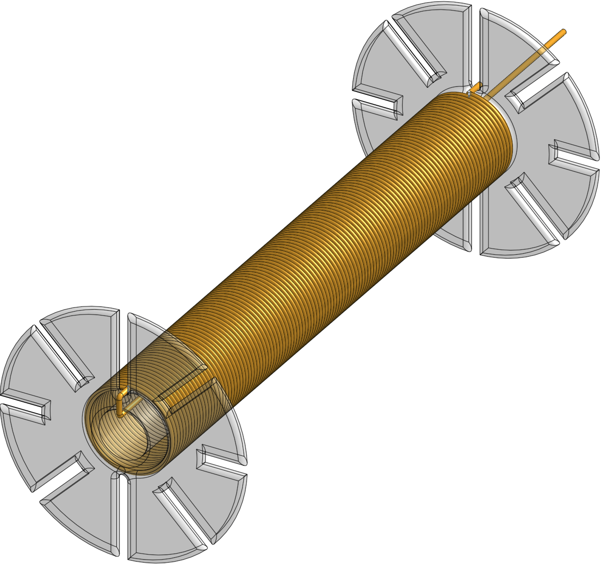
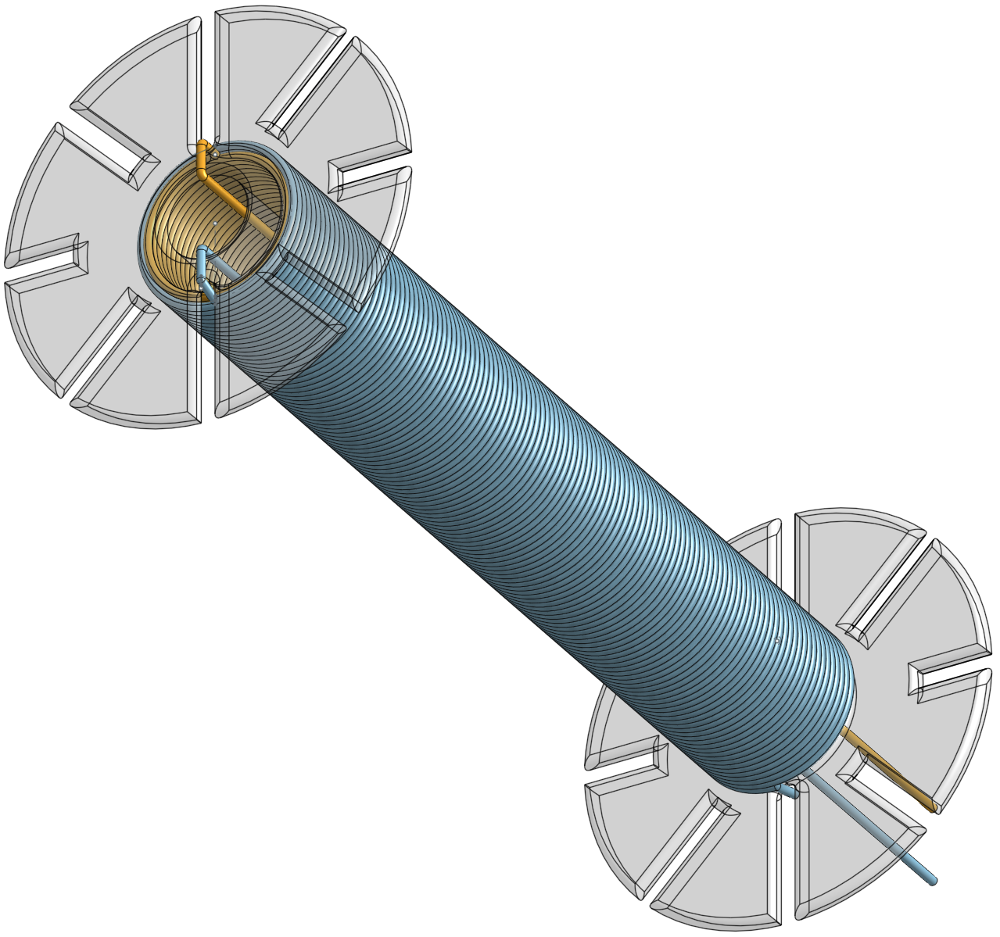
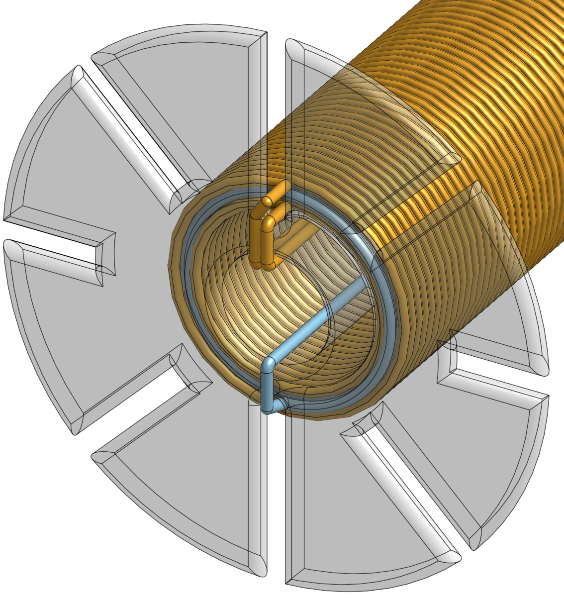
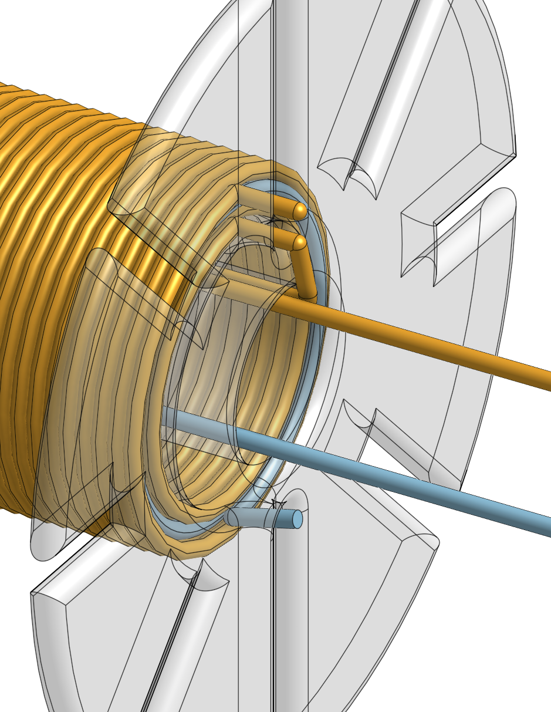

# Bifilar Electromagnet

Nikola Tesla patented the bifilar coil in [U.S. Patent 512340](
https://teslauniverse.com/nikola-tesla/patents/us-patent-512340-coil-electro-magnets).

The point of the bifilar coil is to add internal capacitance to the coil
between the windings and maximize the voltage between every pair of adjacent
wires. I was thinking that if a coil could be wound in such a manner, why
couldn't an electromagnet?

## How it is wired

Here is a diagram of the first winding:

The second winding is kept separate from the first so that an external
capacitor could be added between the two windings. It is wound similarly
to the first coil, in the same direction:

The third winding is a continuation of the wire from the first winding.
Here is a view from the front of the coil:

Here is a view from the back of the coil:

----------------------------------------------------------------------

Enjoy!

----------------------------------------------------------------------

# License

Copyright 2019 Glenn M. Lewis. All Rights Reserved.

Licensed under the Apache License, Version 2.0 (the "License");
you may not use this file except in compliance with the License.
You may obtain a copy of the License at

    http://www.apache.org/licenses/LICENSE-2.0

Unless required by applicable law or agreed to in writing, software
distributed under the License is distributed on an "AS IS" BASIS,
WITHOUT WARRANTIES OR CONDITIONS OF ANY KIND, either express or implied.
See the License for the specific language governing permissions and
limitations under the License.
