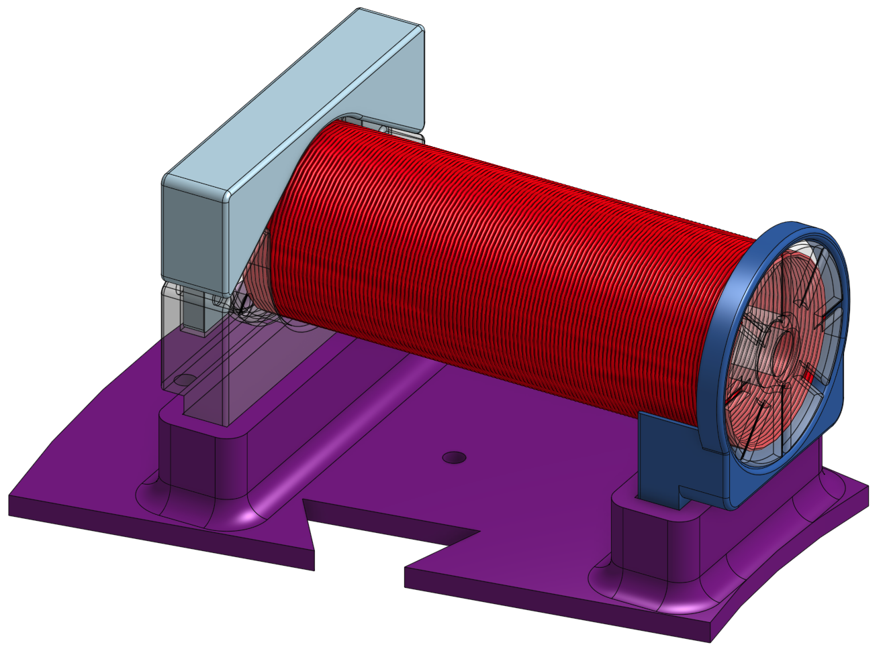
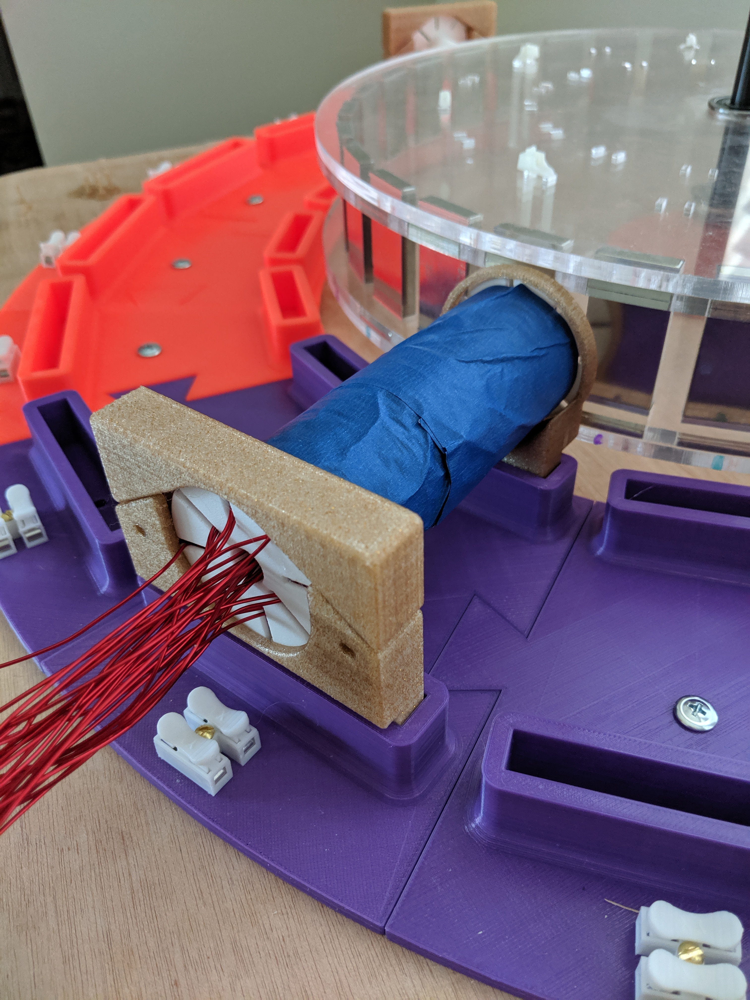

# Bifilar Electromagnet

Nikola Tesla patented the bifilar coil in [U.S. Patent 512340](
https://teslauniverse.com/nikola-tesla/patents/us-patent-512340-coil-electro-magnets).

The point of the bifilar coil is to add internal capacitance to the coil
between the windings and maximize the voltage between every pair of adjacent
wires. I was thinking that if a coil could be wound in such a manner, why
couldn't an electromagnet?

## Electromagnet 1 - How it is wired

This electromagnet is wound with two wires. They remain separate until the
very end. First, `wire 1` is used to wind `coil 1`. Then `wire 2` is used
to wind `coil 2` directly on top of `coil 1`. Then `wire 1` is wrapped back
around (through the center air gap) to the front of the electromagnet spool
holder and is used to wind `coil 3`. Then `wire 2` is wrapped back around
and used to wind `coil 4`. They alternate back and forth until 14 total
coils are wrapped.

Each coil has 120 turns.

Finally, the end of `wire 1` (coils 1, 3, 5, 7, 9, 11, and 13) can be
connected to the start of `wire 2` (coils 2, 4, 6, 8, 10, 12, and 14)
and the end of `wire 2` can return to the circuit.

Optionally, instead of connecting the end of `wire 1` to the start of `wire 2`,
a capacitor (or variable capacitor) can be placed in between (in series)
in order to tune the capacitance to ideally make the resonant frequency
of the coil the same as its main oscillating frequency (in the case of
a brushless motor, for example).

Here is a diagram of the first winding:

The second winding is kept separate from the first so that an external
capacitor could be added between the two windings. It is wound similarly
to the first coil, in the same direction:

The third winding is a continuation of the wire from the first winding.
Here is a view from the front of the coil:

Here is a view from the back of the coil:

### Winding data (lengths are approximate)

|  Winding  | Length (mm) | Length (ft) | Wire 1 (mm) | Wire 2 (mm) | DC resistance (Ω) | Inductance (mH) |
|   :---:   |   :---:     |   :---:     |   :---:     |   :---:     |      :---:        |      :---:      |
|     1     |    6410     |   21.03     |    6410     |             |       0.9         |      0.03       |
|     2     |    7164     |   23.51     |             |    7164     |       0.9         |      0.03       |
|     3     |    7918     |   25.98     |    7918     |             |       0.9         |      0.03       |
|     4     |    8672     |   28.45     |             |    8672     |       0.9         |      0.02       |
|     5     |    9426     |   30.93     |    9426     |             |       0.9         |      0.04       |
|     6     |   10179     |   33.40     |             |   10179     |       1.0         |      0.04       |
|     7     |   10933     |   35.87     |   10933     |             |       0.9         |      0.05       |
|     8     |   11687     |   38.34     |             |   11687     |       1.0         |      0.05       |
|     9     |   12441     |   40.82     |   12441     |             |       1.0         |      0.06       |
|    10     |   13195     |   43.29     |             |   13195     |       1.4         |      0.06       |
|    11     |   13949     |   45.76     |   13949     |             |       1.0         |      0.07       |
|    12     |   14703     |   48.24     |             |   14703     |       1.0         |      0.07       |
|    13     |   15834     |   51.95     |   15834     |             |       1.0         |      0.07       |
|    14     |   16211     |   53.19     |             |   16211     |       1.2         |      0.07       |
|thru middle|    2100     |    6.89     |    1050     |    1050     |       ---         |       ---       |
|  Total    |  160822     |  527.63     |   77961     |   82861     |                   |                 |

The capacitance between Wire 1 and Wire 2 is:

### Final assembly

----------------------------------------------------------------------

Enjoy!

----------------------------------------------------------------------

# License

Copyright 2019 Glenn M. Lewis. All Rights Reserved.

Licensed under the Apache License, Version 2.0 (the "License");
you may not use this file except in compliance with the License.
You may obtain a copy of the License at

    http://www.apache.org/licenses/LICENSE-2.0

Unless required by applicable law or agreed to in writing, software
distributed under the License is distributed on an "AS IS" BASIS,
WITHOUT WARRANTIES OR CONDITIONS OF ANY KIND, either express or implied.
See the License for the specific language governing permissions and
limitations under the License.
