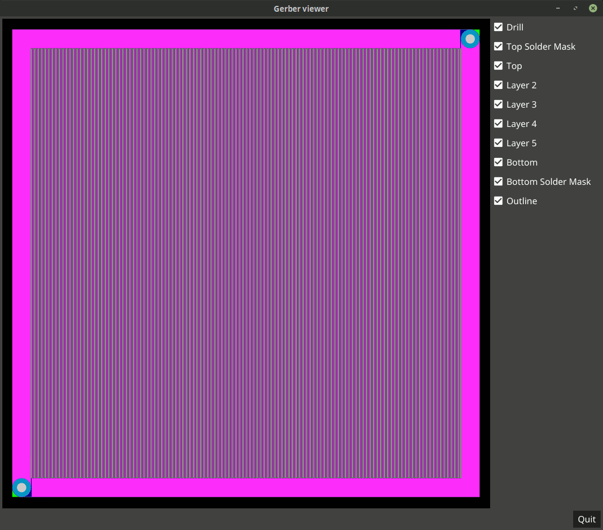
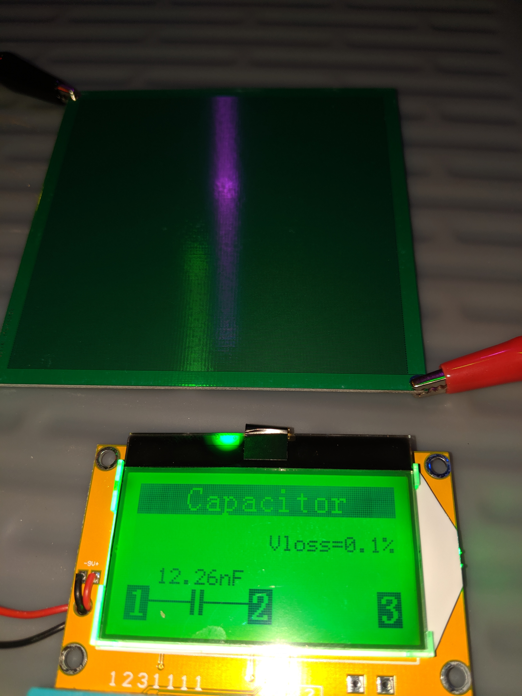

# Hex (6-layer) capacitor

This is a design of a hex-layer capacitor, meaning that when this design is
fabricated on a six-layer printed circuit board (PCB), there will be 12
capacitor plates (two per layer) creating a dielectric field between the
traces within a single layer and between the traces across layers.

## Parametric design

In this design, plate wires can be created with varying trace widths,
gaps between traces, and overall size of the board. As a result, this
parametric design could theoretically be used for capacitors of any
manufacturable size (from microscopic on up).

This shows the various layers on a 100mm x 100mm PCB:

## Example capacitors

In this section, we will document emperically-measured
capacitances as they become available.

### Capacitor 1

This capacitor uses a 1.6mm PCB thickness and measures 12.26nF.

----------------------------------------------------------------------

Enjoy!

----------------------------------------------------------------------

# License

Copyright 2019 Glenn M. Lewis. All Rights Reserved.

Licensed under the Apache License, Version 2.0 (the "License");
you may not use this file except in compliance with the License.
You may obtain a copy of the License at

    http://www.apache.org/licenses/LICENSE-2.0

Unless required by applicable law or agreed to in writing, software
distributed under the License is distributed on an "AS IS" BASIS,
WITHOUT WARRANTIES OR CONDITIONS OF ANY KIND, either express or implied.
See the License for the specific language governing permissions and
limitations under the License.
