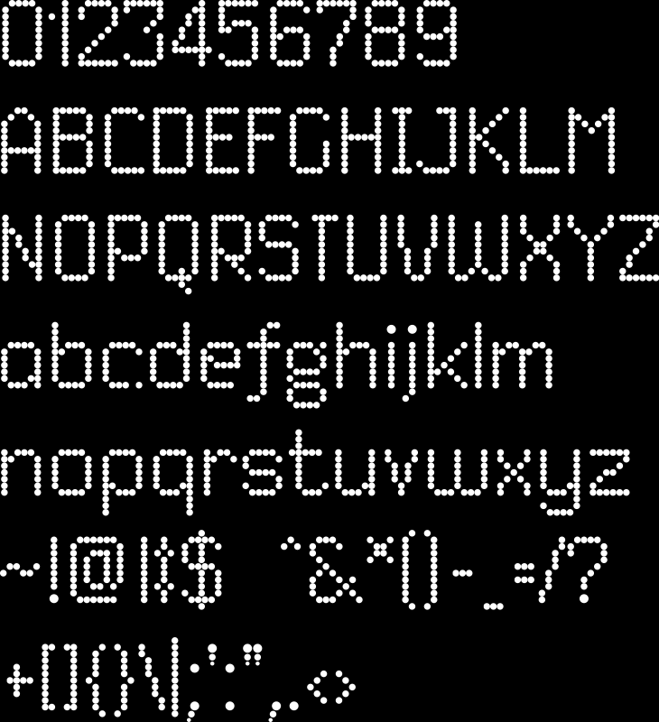

# dited



To use this font in your code, simply import it:

```go
import (
	. "github.com/gmlewis/go-gerber/gerber"
	_ "github.com/gmlewis/go-gerber/gerber/fonts/dited"
)

func main() {
	// ...
	Text(x, y, 1.0, message, "dited", pts),
	// ...
}
```
